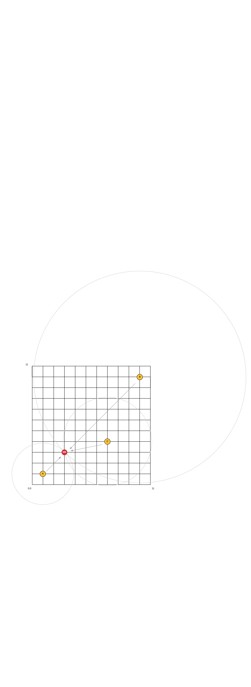
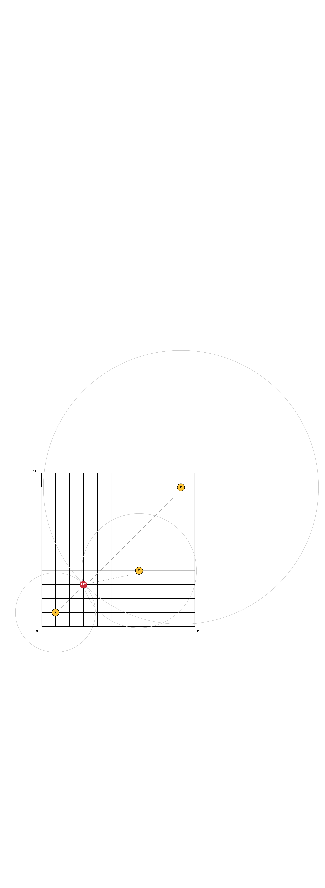

# Positioning in Rust

I was camping and thinking about GPS, also just the idea of positioning in general - this remined me of an awesome living drone (bees) project. In this project they create a simple positioning program to find the current location of a bee on a farm!

So this repo is really just a scratchpad for some of the math used in GPS written in Rust (with no internet!)

### Fun math

In order to wrap my head around the math of trilateration - I had a quick flashback to high school tri. Sin Cos? Tan? remember those things. Well they finally became useful.

## What is this magic?

Okay so how does this trickery work? Basically if we know where 3 points are, and we know our distance to those points we can figure out our position!

## Located by circles

Just knowing the distance does not point us to the exact location. But using the distance to draw circles around the beacons we can point the exact location by finding the point where all 3 circles overlap. 

## So, how far?

Simply - the circles represent possible locations of that distance from the beacon, and we want to find the precise location associated with the distances we know.

## Sound into distance

Okay awesome - we see how using three distances from three beacons can locate us in space. Now how do we actually get these distances? 

We use radio waves and time. If you know the speed and delivery time of a message - we can determine the distance it traveled.

### The concept

We need three points that emit a message at a set interval - this message contains the beacons current location and the current time

A reciever who is in range to these three beacons will receieve those messages from the beacons and use there location and the time sent - to determine there location.

This is simple maths in a clever way. First we conver the time to distance; `distance = velocity * time` so we just subract the beacon send time from the current time and divide by the speed of light (for this code) we just use euclidean distance on a 2D plane. 

Next we take those distances and use them as the radius for a circled centered around the originating beacon. This essentially is generating three circles around those three beacons and they represent the possible locations that are a specific distance from each beacon. 

Since the reciever is all three of those distances from those three beacons - the intersecting location of all three will be the recievers current location!

We can generate the points on a circle with it's radius, centerpoint - and angle we want to create a point for. These angles are represented in radians - so we break the full circle 2PI radians by the number of points we want to generate per circle. 

In this code base - we make 1000 points for each circle. We only do 1000 iterations since we care more about speed and approximations of location more then we care about accuracy. We could make many more points on the circle but this likely will take more time and the error will only be reduced slightly. 

